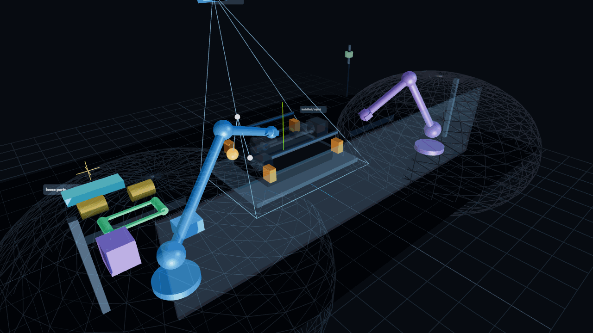
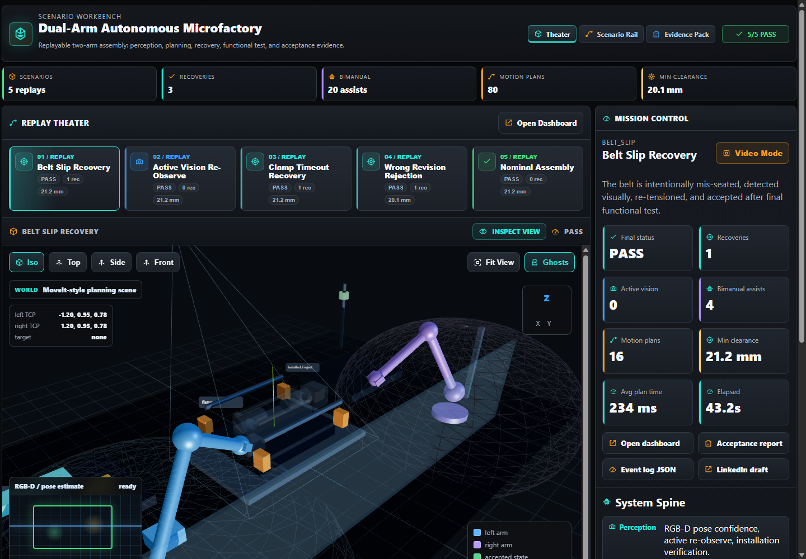
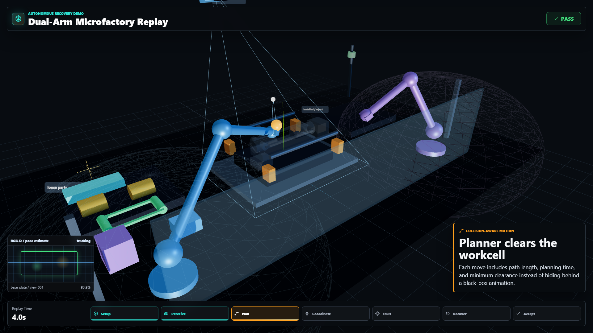
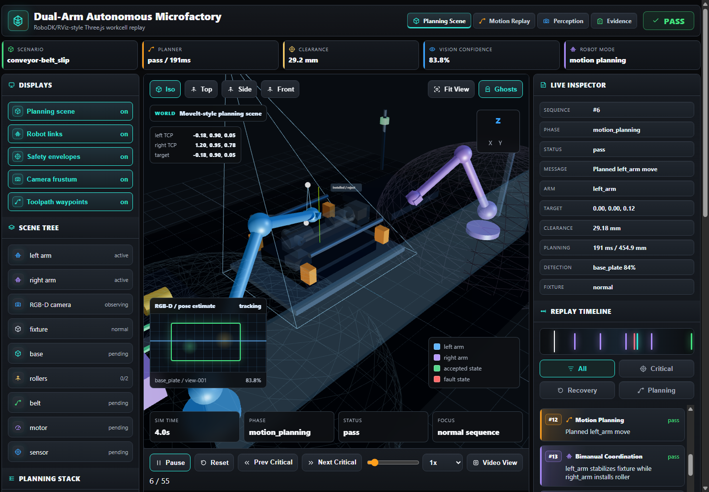

# Dual-Arm Autonomous Microfactory

Vision-guided robotic assembly cell that builds, tests, and recovers a working mini
conveyor module from loose parts.

[Live demo](https://earosenfeld.github.io/dual-arm-microfactory/demo/) |
[Demo recording guide](docs/linkedin-recording-guide.md) |
[Architecture](docs/architecture.md)



The project is simulation-first by design: the first version proves the architecture,
failure handling, and demo story before any hardware is purchased or wired. Real robot,
camera, PLC, and force-control adapters will replace the simulation ports over time.

## Why This Exists

Most robotics demos show a happy-path pick and place. This project is built around the
harder industrial problem: a robot should understand uncertainty, recover when the world
does not match the plan, and produce evidence that the cell did the right thing.

The target demo:

1. Two arms assemble a mini conveyor module from loose parts.
2. Vision identifies parts and estimates pose.
3. Motion planning chooses collision-aware grasps and paths.
4. One arm holds while the other inserts or seats parts.
5. The system intentionally encounters failures.
6. Recovery logic corrects the failure or sends the part to reject.
7. A final functional test runs the conveyor.
8. The cell exports an acceptance report with a full event timeline.

## What Experts Should Notice

- The deterministic supervisor owns state transitions, retries, recovery, and final
  acceptance.
- Vision confidence drives active re-observe events instead of pretending perception is
  always perfect.
- Motion plans carry path length, planning time, and minimum clearance into the event
  log.
- Bimanual steps are represented explicitly: one arm stabilizes while the other installs.
- The same event log produces the dashboard replay, acceptance report, metrics, and
  cinematic video mode.
- Learned subskills are planned as bounded local policies, not as the safety-critical
  system owner.

## Current MVP

The repository currently includes a deterministic simulation core:

- Conveyor assembly scenario.
- Simulated active vision with confidence and next-best-view retries.
- Grasp scoring and motion planning checks.
- Bimanual coordination events for fixture stabilization and installation.
- Recovery-aware assembly controller.
- Failure injection for belt slip, clamp failure, and low-confidence vision.
- Markdown acceptance report and static HTML dashboard output.
- LinkedIn demo package generation.
- RoboDK/RViz-style Three.js/WebGL viewport with grid floor, axes, robot links,
  tool motion, planned paths, camera frustum, and event-driven assembly state.

Run it:

```bash
PYTHONPATH=src python3 -m microfactory run --scenario belt_slip
```

Generate the LinkedIn-ready demo package:

```bash
PYTHONPATH=src python3 -m microfactory demo
```

The generated `index.html` is an interactive scenario workbench with embedded replay
dashboards, comparison metrics, reports, and a video mode. Serve it with a local
HTTP server so the browser can load the vendored Three.js module.

The public demo is deployed from `docs/demo` with GitHub Pages:

```text
https://earosenfeld.github.io/dual-arm-microfactory/demo/
```

Run tests:

```bash
PYTHONPATH=src python3 -m unittest discover -s tests
```

## Screenshots

### Replay Workbench



### Cinematic Video Mode



### Engineering Dashboard



## Near-Term Roadmap

- Add real-time WebSocket dashboard.
- Add ROS 2 message adapters for pose, plan, command, and event streams.
- Add MoveIt 2 planning adapter.
- Add RGB-D perception adapter with FoundationPose/SAM 2 integration.
- Add real calibration workflow using AprilTags.
- Add physical fixture with sensors and a simulated PLC handshake.
- Add learned local insertion policy as an optional subskill.

## Demo Recording

See [docs/linkedin-recording-guide.md](docs/linkedin-recording-guide.md) for the
recommended screen-recording flow and caption framing.
See [docs/app-workbench.md](docs/app-workbench.md) for the generated application surface.

## Non-Goals

- This is not an LLM-controls-a-robot demo.
- This is not a fragile one-object pick-and-place script.
- This project uses synthetic scenarios and contains no customer work, employer proprietary IP, or production robot code.
